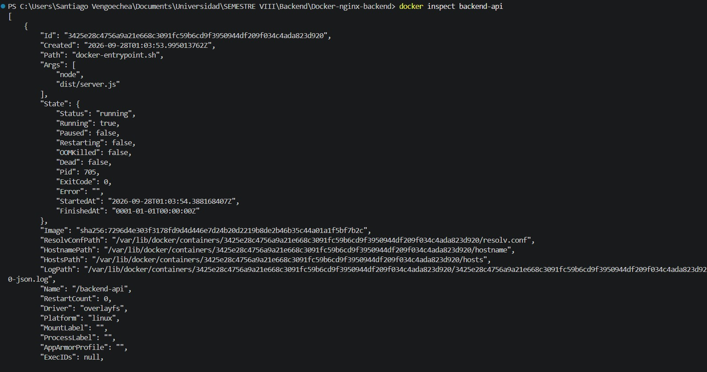
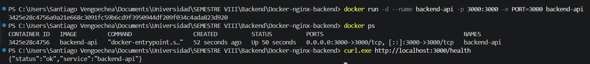
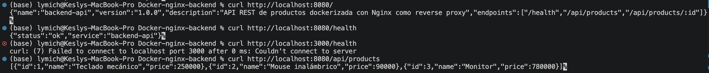
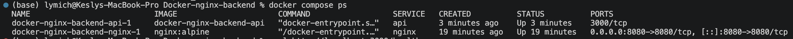
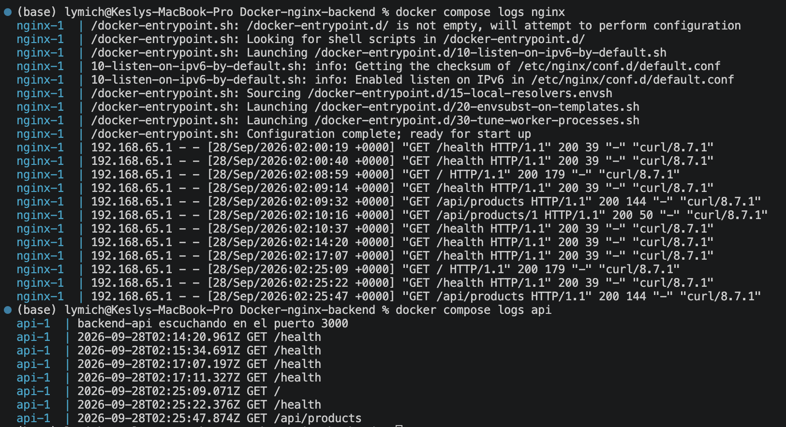
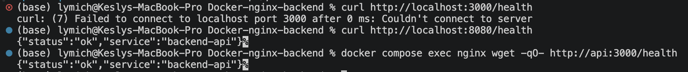
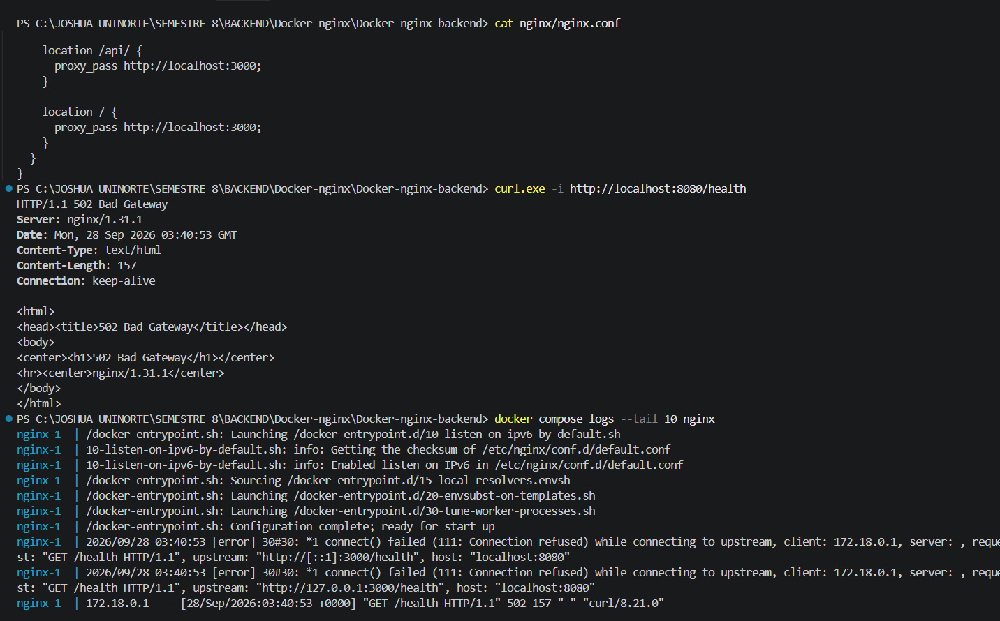
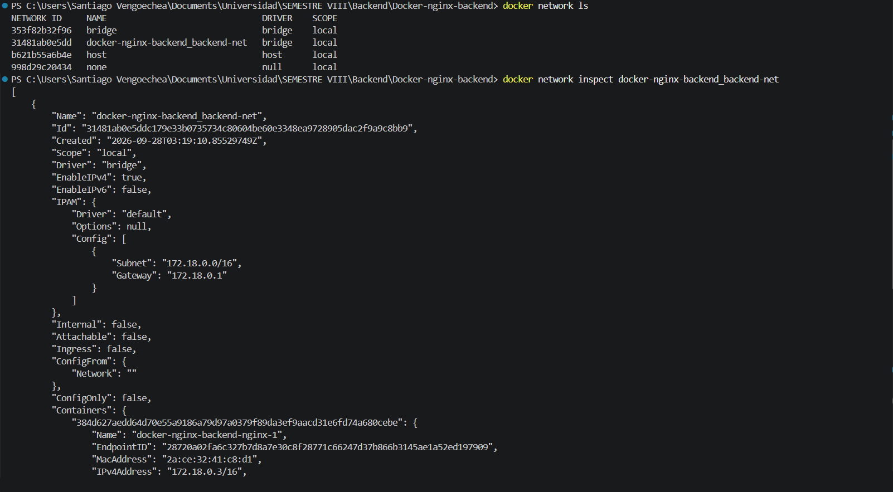
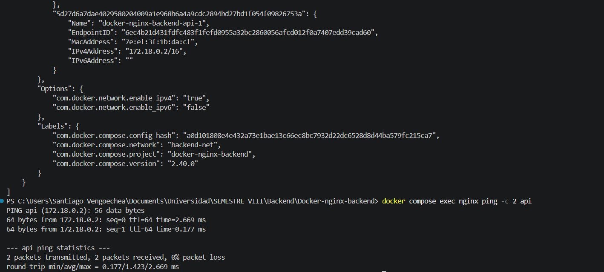
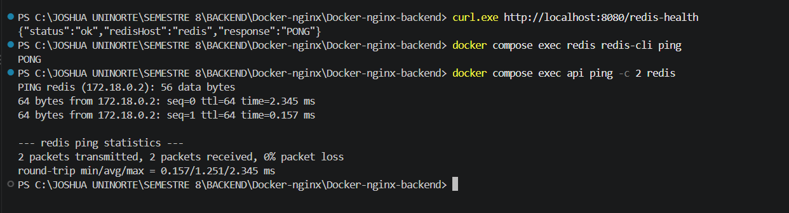

# Taller Práctico: Docker + Nginx — Backend

Dockerización de una API REST con Node.js, Express y TypeScript, publicada a través de Nginx como reverse proxy y orquestada con Docker Compose.

**Integrantes:**

| Integrante | Rol | Partes del taller |
|---|---|---|
| Joshua Lobo | Desarrollo de la API | Parte 1, Parte 10 (reto Redis), README |
| Santiago Vengoechea | Docker | Partes 2, 3 y 9 (troubleshooting) |
| Kesly Rodríguez | Docker Compose y Nginx | Partes 4, 5, 6, 7 y 8 (pruebas) |

---

## Tabla de contenido

1. [Descripción de la solución](#1-descripción-de-la-solución)
2. [Arquitectura implementada](#2-arquitectura-implementada)
3. [Estructura del proyecto](#3-estructura-del-proyecto)
4. [Instrucciones para ejecutar el proyecto](#4-instrucciones-para-ejecutar-el-proyecto)
5. [Endpoints de la API](#5-endpoints-de-la-api)
6. [Comandos Docker utilizados](#6-comandos-docker-utilizados)
7. [Análisis del contenedor (Parte 3)](#7-análisis-del-contenedor-parte-3)
8. [Puerto del contenedor vs puerto publicado](#8-puerto-del-contenedor-vs-puerto-publicado)
9. [ports vs expose](#9-ports-vs-expose)
10. [localhost vs nombre del servicio Docker](#10-localhost-vs-nombre-del-servicio-docker)
11. [Evidencias de las pruebas](#11-evidencias-de-las-pruebas)
12. [Troubleshooting: error con http://localhost:3000](#12-troubleshooting-error-con-httplocalhost3000)
13. [Reto adicional: servicio Redis](#13-reto-adicional-servicio-redis)

---

## 1. Descripción de la solución

La empresa tenía una API REST en Node.js y Express que se ejecutaba directamente en `http://localhost:3000`. El requerimiento del equipo de infraestructura era:

- Ejecutar la API dentro de un contenedor Docker.
- Que **Nginx** sea el único punto de entrada.
- Que los usuarios **no puedan acceder directamente** al contenedor de la API.

Para cumplirlo:

1. Se desarrolló una API en **Express + TypeScript** que lee su puerto desde la variable de entorno `PORT` (el puerto no está escrito en el código; si la variable no existe, la aplicación se detiene con un error claro).
2. Se creó un **Dockerfile** que construye la imagen de la API: instala dependencias, compila TypeScript a JavaScript (`dist/`) y ejecuta el servidor.
3. Se creó un **compose.yaml** con tres servicios (`api`, `nginx`, `redis`) conectados a una red Docker propia llamada `backend-net`.
4. **Nginx** escucha en el puerto `8080` y reenvía las peticiones a `http://api:3000` usando el nombre del servicio, no `localhost`.
5. La API **no publica** su puerto al host: solo es alcanzable desde dentro de la red Docker. La única entrada pública es `http://localhost:8080`.
6. Como reto adicional, se agregó **Redis** y un endpoint `/redis-health` que demuestra que la API se comunica con Redis usando su nombre DNS (`redis`).

**Tecnologías:** Node.js 22, Express 5, TypeScript, Docker, Docker Compose, Nginx (alpine), Redis 7 (alpine).

---

## 2. Arquitectura implementada

```
              Usuario / navegador / curl
                        |
                        |  http://localhost:8080   (única entrada pública)
                        v
   ============================ HOST ============================
                        |
                        | ports: "8080:8080"
                        v
                +---------------+
                |     nginx     |  reverse proxy, escucha en 8080
                +-------+-------+
                        |
         ---------- Docker "backend-net" ----------
         (DNS interno: api, nginx, redis)
                        |
                        |  http://api:3000
                        v
                +---------------+
                |      api      |  Express, escucha en 3000
                |               |  expose: 3000 (NO publicado al host)
                +-------+-------+
                        |
                        |  redis://redis:6379
                        v
                +---------------+
                |     redis     |  expose: 6379 (NO publicado al host)
                +---------------+
```

**Recorrido de una petición** (`GET http://localhost:8080/api/products`):

1. El usuario envía la petición al puerto `8080` del host.
2. Docker la redirige al puerto `8080` del contenedor `nginx`.
3. Nginx busca el bloque `location` que coincide (`/api/`) y la reenvía a `http://api:3000/api/products`.
4. El DNS interno de Docker traduce `api` a la IP del contenedor de la API.
5. La API responde a Nginx y Nginx devuelve la respuesta al usuario.

El usuario nunca habla directamente con la API.

---

## 3. Estructura del proyecto

```
Docker-nginx-backend/
├── src/
│   └── server.ts          # Código de la API (Express + TypeScript)
├── nginx/
│   └── nginx.conf         # Configuración de Nginx como reverse proxy
├── evidencias/            # Capturas de las pruebas
├── Dockerfile             # Construcción de la imagen de la API
├── .dockerignore          # Archivos excluidos de la imagen
├── compose.yaml           # Servicios api, nginx y redis
├── package.json           # Dependencias y scripts
├── package-lock.json      # Versiones exactas de las dependencias
├── tsconfig.json          # Configuración del compilador TypeScript
└── README.md
```

---

## 4. Instrucciones para ejecutar el proyecto

### Requisitos

- Docker Desktop (o Docker Engine) con Docker Compose v2.
- Opcional, para desarrollo local sin Docker: Node.js 22.

### Ejecutar con Docker Compose (forma principal)

```bash
git clone https://github.com/Jlobo0210/Docker-nginx-backend.git
cd Docker-nginx-backend
docker compose up -d --build
```

Verificar:

```bash
docker compose ps
curl http://localhost:8080/health
```

Detener y eliminar contenedores y red:

```bash
docker compose down
```

### Ejecutar solo la API con Docker (Parte 2)

```bash
docker build -t backend-api .
docker run -d --name backend-api -p 3000:3000 -e PORT=3000 backend-api
curl http://localhost:3000/health
```

Al terminar, liberar el puerto antes de usar Compose:

```bash
docker rm -f backend-api
```

### Ejecutar la API localmente sin Docker (desarrollo)

```bash
npm install
PORT=3000 npm run dev              # Linux / Mac / Git Bash
$env:PORT=3000; npm run dev        # Windows PowerShell
```

### Scripts disponibles

| Script | Comando | Uso |
|---|---|---|
| `npm run dev` | `tsx watch src/server.ts` | Desarrollo con recarga automática |
| `npm run build` | `tsc` | Compila TypeScript a `dist/` |
| `npm start` | `node dist/server.js` | Ejecuta la versión compilada |

---

## 5. Endpoints de la API

Todos se consumen a través de Nginx en `http://localhost:8080`.

| Método | Endpoint | Respuesta |
|---|---|---|
| GET | `/` | Información de la API y lista de endpoints |
| GET | `/health` | `{"status":"ok","service":"backend-api"}` |
| GET | `/api/products` | Lista de productos |
| GET | `/api/products/:id` | Producto específico, o `404` si no existe |
| GET | `/redis-health` | Resultado de enviar `PING` a Redis (reto) |

Ejemplo de respuesta de `/api/products/2`:

```json
{ "id": 2, "name": "Mouse inalámbrico", "price": 90000 }
```

---

## 6. Comandos Docker utilizados

| Comando | Para qué sirve |
|---|---|
| `docker build -t backend-api .` | Construye la imagen a partir del Dockerfile. `-t` le asigna un nombre; `.` es el contexto de build |
| `docker images` | Lista las imágenes locales |
| `docker run -d --name backend-api -p 3000:3000 -e PORT=3000 backend-api` | Crea y arranca un contenedor en segundo plano, publica el puerto y define la variable `PORT` |
| `docker ps` / `docker ps -a` | Lista contenedores en ejecución / todos, incluidos los detenidos |
| `docker logs backend-api` | Muestra la salida (`console.log`) de la aplicación |
| `docker inspect backend-api` | Muestra toda la configuración del contenedor en JSON |
| `docker stop` / `docker rm` / `docker rm -f` | Detiene / elimina / fuerza la eliminación de un contenedor |
| `docker compose up -d --build` | Construye las imágenes y levanta todos los servicios |
| `docker compose ps` | Estado de los servicios del proyecto |
| `docker compose logs nginx` / `docker compose logs api` | Logs de cada servicio |
| `docker compose exec <servicio> <comando>` | Ejecuta un comando dentro de un contenedor en ejecución |
| `docker compose restart nginx` | Reinicia un servicio (por ejemplo, tras cambiar `nginx.conf`) |
| `docker compose down` | Detiene y elimina contenedores y la red del proyecto |
| `docker network ls` | Lista las redes Docker |
| `docker network inspect docker-nginx-backend_backend-net` | Muestra los contenedores conectados a la red y sus IP |

### Explicación del Dockerfile

```dockerfile
FROM node:22-alpine                       # 1. Imagen oficial de Node.js (LTS, ligera)
WORKDIR /app                              # 2. Directorio de trabajo
COPY package.json package-lock.json ./    # 3. Primero solo los archivos de dependencias
RUN npm install                           # 4. Instala dependencias
COPY . .                                  # 5. Copia el código...
RUN npm run build                         #    ...y lo compila a dist/
EXPOSE 3000                               # 6. Documenta el puerto de la app
CMD ["node", "dist/server.js"]            # 7. Arranca el servidor
```

Se copian `package.json` y `package-lock.json` **antes** del código para aprovechar la **caché de capas** de Docker: si solo cambia el código, Docker reutiliza la capa de `npm install` y el build es mucho más rápido.

El `.dockerignore` excluye `node_modules`, `dist` y `.git` para no copiar archivos innecesarios o compilados para otro sistema operativo.

---

## 7. Análisis del contenedor (Parte 3)

Con el contenedor de la Parte 2 en ejecución se usaron `docker logs backend-api` y `docker inspect backend-api`. Para extraer cada dato:

| Dato | Comando | Valor obtenido |
|---|---|---|
| ID del contenedor | `docker inspect -f '{{.Id}}' backend-api` | `3425e28c4756a9a21e668c3091fc59b6cd9f3950944df209f034c4ada823d920` |
| Imagen utilizada | `docker inspect -f '{{.Config.Image}}' backend-api` | `backend-api` |
| Puerto publicado | `docker inspect -f '{{json .NetworkSettings.Ports}}' backend-api` | `3000/tcp -> 0.0.0.0:3000` |
| Variables de entorno | `docker inspect -f '{{json .Config.Env}}' backend-api` | `PORT=3000`, `PATH=/usr/local/sbin:/usr/local/bin:/usr/sbin:/usr/bin:/sbin:/bin`, `NODE_VERSION=22.23.3` |
| Redes | `docker inspect -f '{{json .NetworkSettings.Networks}}' backend-api` | `bridge`, IP `172.17.0.2` |
| Estado | `docker inspect -f '{{.State.Status}}' backend-api` | `running` |



---

## 8. Puerto del contenedor vs puerto publicado

Cada contenedor tiene su **propia red aislada**, con su propia IP y sus propios puertos.

- **Puerto del contenedor** (`3000`): es donde la aplicación escucha *dentro* de su contenedor. Por sí solo no es accesible desde el host.
- **Puerto publicado** (el primer número de `-p HOST:CONTENEDOR`): es un puerto del **computador host** que Docker conecta con el puerto del contenedor.

Con `-p 3000:3000` ambos coinciden, pero son independientes. Por ejemplo, con `-p 4000:3000` la API sigue escuchando en el 3000 dentro del contenedor, pero desde el host se accede por `http://localhost:4000`.

Por esta misma razón, la API escucha en `0.0.0.0` (todas las interfaces) y no en `127.0.0.1`: el tráfico que llega desde el host o desde Nginx entra por la interfaz de red del contenedor, no por su loopback.

---

## 9. ports vs expose

| | `ports` | `expose` |
|---|---|---|
| Qué hace | Publica un puerto del contenedor en el **host** (`HOST:CONTENEDOR`) | Declara el puerto como disponible **solo dentro de la red Docker** |
| ¿Accesible desde el navegador del host? | Sí | No |
| Uso en este proyecto | `nginx`: `"8080:8080"` | `api`: `"3000"`, `redis`: `"6379"` |

En la Parte 7 se reemplazó `ports: "3000:3000"` por `expose: "3000"` en el servicio `api`. Resultado:

- `http://localhost:3000` → **falla** (la API ya no es accesible desde el host).
- `http://localhost:8080` → **funciona** (entrada a través de Nginx).
- Nginx sigue llegando a `http://api:3000` porque ambos están en la red `backend-net`.

Dentro de una red Docker, los contenedores pueden comunicarse por cualquier puerto en el que el otro esté escuchando, incluso sin `expose`, por lo que funciona sobre todo como documentación del puerto que usa el servicio (igual que `EXPOSE` en el Dockerfile). Lo que aísla a la API del exterior es no declarar `ports`.

---

## 10. localhost vs nombre del servicio Docker

**`localhost` (127.0.0.1) siempre significa "este mismo contenedor".** Cada contenedor tiene su propio espacio de red y su propio localhost.

- Dentro del contenedor `nginx`, `localhost:3000` apunta al propio contenedor de Nginx, donde no hay nada escuchando en el puerto 3000.
- No apunta al computador host ni a otro contenedor.

**`api` es el nombre del servicio definido en `compose.yaml`.** Docker Compose crea una red con un **DNS interno** en el que cada servicio se registra con su nombre. Cuando Nginx resuelve `api`, Docker le devuelve la IP actual del contenedor de la API. Por eso `http://api:3000` funciona.

Se usa el nombre y no la IP porque las IP de los contenedores pueden cambiar cada vez que se recrean, mientras que el nombre del servicio es estable.

Configuración de Nginx utilizada (`nginx/nginx.conf`):

```nginx
events {}

http {
  server {
    listen 8080;

    proxy_set_header Host              $host;
    proxy_set_header X-Real-IP         $remote_addr;
    proxy_set_header X-Forwarded-For   $proxy_add_x_forwarded_for;
    proxy_set_header X-Forwarded-Proto $scheme;

    location = /health {
      proxy_pass http://api:3000/health;
    }

    location /api/ {
      proxy_pass http://api:3000;
    }

    location / {
      proxy_pass http://api:3000;
    }
  }
}
```

| Petición del usuario | `location` que coincide | Nginx reenvía a |
|---|---|---|
| `GET localhost:8080/health` | `= /health` (exacta) | `http://api:3000/health` |
| `GET localhost:8080/api/products` | `/api/` (prefijo) | `http://api:3000/api/products` |
| `GET localhost:8080/` | `/` | `http://api:3000/` |

---

## 11. Evidencias de las pruebas

> Las capturas se encuentran en la carpeta `evidencias/`.

### 11.1 API en un contenedor individual (Parte 2)

```bash
docker ps
curl http://localhost:3000/health
```



### 11.2 Pruebas a través de Nginx (Parte 8)

```bash
curl http://localhost:8080/
curl http://localhost:8080/health
curl http://localhost:8080/api/products
```

Resultados esperados:

```
{"name":"backend-api","version":"1.0.0",...}
{"status":"ok","service":"backend-api"}
[{"id":1,"name":"Teclado mecánico","price":250000},...]
```



### 11.3 Estado de los servicios

```bash
docker compose ps
```

Se observa que solo `nginx` tiene un puerto publicado (`0.0.0.0:8080->8080/tcp`), mientras que `api` muestra `3000/tcp` sin publicar.



### 11.4 Logs de Nginx y de la API

```bash
docker compose logs nginx
docker compose logs api
```

La misma petición aparece en ambos logs: primero la recibe Nginx y luego la API. Esto demuestra el recorrido a través del reverse proxy.



### 11.5 Acceso directo al backend bloqueado (Parte 7)

```bash
curl http://localhost:3000/health    # Falla: Connection refused
curl http://localhost:8080/health    # Funciona
docker compose exec nginx wget -qO- http://api:3000/health   # Funciona desde dentro de la red
```



---

## 12. Troubleshooting: error con http://localhost:3000

### Procedimiento

Se modificó temporalmente `nginx/nginx.conf`, reemplazando `http://api:3000` por `http://localhost:3000` en las directivas `proxy_pass`, y se ejecutó:

```bash
docker compose down
docker compose up -d
curl -i http://localhost:8080/health
docker compose logs nginx
```

### 1. ¿Qué error se obtiene?

**`502 Bad Gateway`.**

```
HTTP/1.1 502 Bad Gateway
Server: nginx
```

En los logs de Nginx:

```
connect() failed (111: Connection refused) while connecting to upstream,
... upstream: "http://127.0.0.1:3000/health"
```



### 2. ¿Por qué ocurre?

Nginx intenta conectarse a `localhost:3000`, que dentro de su contenedor es el **propio contenedor de Nginx**. Ahí no hay ningún proceso escuchando en el puerto 3000, así que la conexión es rechazada (`Connection refused`). Nginx está funcionando, pero no obtiene respuesta del servidor interno (el *upstream*), y por eso responde `502 Bad Gateway`.

La pista está en el log: el upstream aparece como `127.0.0.1`, es decir, Nginx se está intentando conectar a sí mismo.

### 3. ¿Por qué localhost no representa al contenedor api?

Cada contenedor tiene su propio espacio de red (*network namespace*), con su propia interfaz de loopback. `localhost` siempre se refiere al contenedor desde donde se usa. La API vive en **otro contenedor**, con **otra IP**, dentro de la red `backend-net`. Para llegar a ella hay que usar su nombre de servicio (`api`), que el DNS interno de Docker traduce a la IP correcta.

### 4. ¿Cómo se soluciona?

Volviendo a usar el nombre del servicio en `nginx.conf`:

```nginx
proxy_pass http://api:3000;
```

asegurando que `nginx` y `api` estén en la misma red, y reiniciando Nginx:

```bash
docker compose restart nginx
curl http://localhost:8080/health    # vuelve a responder 200
```

### 5. ¿Qué comandos se usan para verificar las redes Docker?

```bash
docker network ls
docker network inspect docker-nginx-backend_backend-net
docker compose exec nginx ping -c 2 api
```

- `docker network ls` lista las redes. Compose nombra la red como `<carpeta-del-proyecto>_backend-net`.
- `docker network inspect` muestra qué contenedores están conectados y la IP de cada uno.
- `ping api` desde el contenedor de Nginx comprueba que el nombre se resuelve y responde.




### Error relacionado

Si el nombre usado en `proxy_pass` **no existe** en la red (por ejemplo, un servicio mal escrito o que no comparte red), Nginx ni siquiera arranca y el log muestra `host not found in upstream`. Diferencia:

- **502 Bad Gateway**: el destino se resuelve, pero no responde en ese puerto.
- **host not found**: el nombre del destino no existe en la red.

---

## 13. Reto adicional: servicio Redis

Se agregó un tercer servicio `redis` al `compose.yaml`. La API se conecta a él usando la variable de entorno `REDIS_HOST=redis`, es decir, **por su nombre de servicio y no por localhost**.

```yaml
services:
  api:
    build: .
    environment:
      PORT: "3000"
      REDIS_HOST: redis
    expose:
      - "3000"
    depends_on:
      - redis
    networks:
      - backend-net

  nginx:
    image: nginx:alpine
    ports:
      - "8080:8080"
    volumes:
      - ./nginx/nginx.conf:/etc/nginx/nginx.conf:ro
    depends_on:
      - api
    networks:
      - backend-net

  redis:
    image: redis:7-alpine
    expose:
      - "6379"
    networks:
      - backend-net

networks:
  backend-net:
    driver: bridge
```

En la API se agregó el endpoint `GET /redis-health`, que se conecta a `redis://redis:6379`, envía un `PING` y devuelve la respuesta.

### Pruebas

```bash
curl http://localhost:8080/redis-health
docker compose exec redis redis-cli ping
docker compose exec api ping -c 2 redis
```

Resultados:

```
{"status":"ok","redisHost":"redis","response":"PONG"}
PONG
PING redis (172.x.x.x): 56 data bytes ...
```

La primera prueba recorre la cadena completa usando solo nombres de servicio: **usuario → nginx → api → redis**.



### Comprobación del mismo concepto de la Parte 9

Al cambiar temporalmente `REDIS_HOST: localhost`, `/redis-health` responde un error `ECONNREFUSED 127.0.0.1:6379`. Es el mismo problema del troubleshooting, pero entre la API y Redis: `localhost` apunta al propio contenedor de la API, donde no hay ningún Redis. Al volver a `REDIS_HOST: redis`, la conexión funciona de nuevo.
